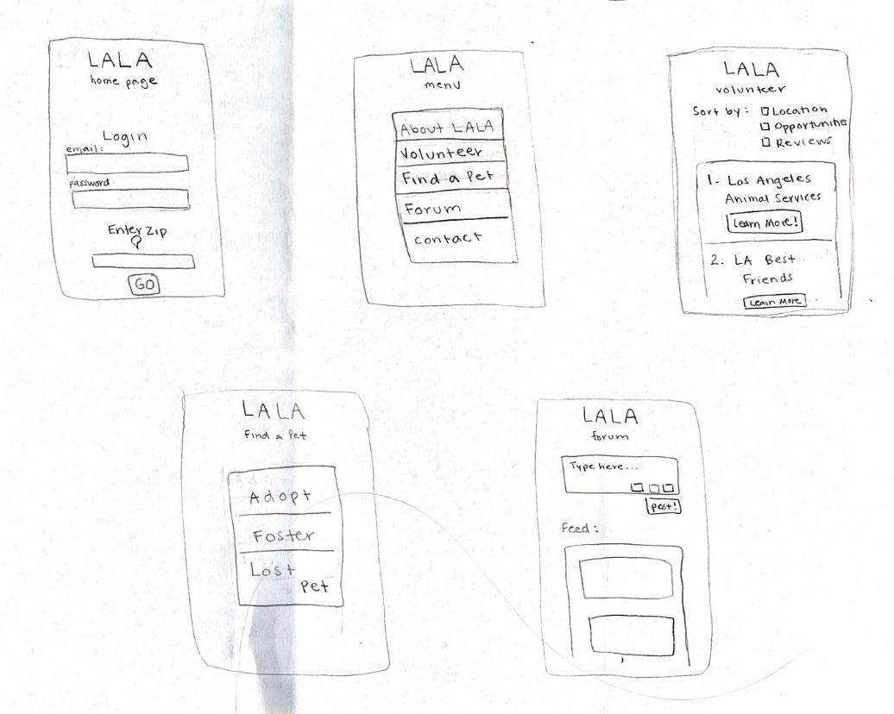

# Low Fidelity Prototype

## Description

This prototype is intended to test three different tasks: finding a volunteer opportunity, posting to the forum, and searching for a lost pet. These tasks are based off of the personas created in attempt to understand the users of the Los Angeles Lover of Animals app. The purpose of this prototype is to test whether or not the page to page flow is user friendly and to see if it is intuitive and streamlined.

The goal for the first task is to find a volunteer opportunity, similar to what the persona "Kelley" is interested in doing. The user starts on the home page and navigates to the menu by entering their email, password, and zip code. Then they would select "Volunteer". From there, the user can sort the opportunities by location, number of spots available, and review scores. In the wireflow the user is prompted to sort by location. Then, the user can pick a shelter by clicking "Learn More". This brings up the full page for that opportunity that contains all of the options with the ability to click on the sections for even more information. The user is prompted to choose opportunities (since they are looking to volunteer). This leads them to the list of opportunities at the shelter they selected, with the option to be re-directed to the shelter's website.

The goal for second task is to post a message on the forum; this is something the persona "Martha" would want to do. The user can navigate from the home page to the menu page by entering their information and then selecting Forum from the menu. The forum page gives users the opportunity to post or scroll through the feed. The user can type their message in the toolbar. Then they have the ability to upload a photo or document by clicking the icons in the bottom corner of the toolbar. They can select the file from a number of options then hit select. When they are finished typing and uploading they can post their message by hitting post in the bottom right corner and it will uploaded to the feed.

The third task is to search for a lost pet, just like the persona "Jim" intended to do. The first step is the same as the other tasks; the user must navigate from the home page to the menu page. From there they select "Find a Pet" and choose "Lost Pet" on the next page. The user then has the option to search for a lost pet or post a flyer. The user in this prototype is prompted to search. They can filter by type of animal, age, etc and load results by clicking "Search" at the bottom of the page. They are then presented with results. If they do not see their lost pet they have the option to click "Enable Alerts" which would alert them if a new pet with their specifications is entered into the system. They also have the ability to return to the "Lost Pet" page and post a flyer.

## Wireframes

## Wireflows

(Task1)

(Task2)

(Task3)

## Testing the Wireflows

(Test1)

(Test2)

(Test3)

## Reflection

