# Streamlining Animal Welfare Websites
Chelsea Grimm, DH150 Winter 2020

For as long as I can remember I have been an animal lover. I remember visiting the local animal shelter as a child and being mesmerized by the puppies and kittens behind glass doors, wanting to pet them all and take them all home. I remember taking my first puppy to training with my mom at our local shelter each week to teach her basic commands and help her adjust to life at home. The connection I feel towards animals also connects me to humans. I feel a community around those who love animals and want to help them as much as I do. Through exploring different websites whose goal is to help animals, I found that there is so much information and resources that it can be overwhelming to a user. 

# Example 1: Los Angeles Animal Services

[LA Animal Services](http://www.laanimalservices.com)

The Los Angeles Animal Services website is a place for users to adopt, foster, or volunteer with animals in Los Angeles. The homepage of the LA Animal Services website has nine drop-down menus to take the user to other pages, as well as quick links to take users to popular pages, both on the LAAS website or other sites like Amazon. The website also contains a sidebar with more links to take users through the website. Some of these pages are purely informational, while others are interactive, containing forms or search engines. There are different interface designs on different pages of the website. 

While the current LA Animal Services website is full of helpful information, it is not organized in a clear, concise way. Some pages are easily accesbile, while others take going through multiple steps to reach them. There are many opportunities for users to miss information because they are not looking in the right place on the site. Overall, the LAAS website could be majorly improved by streamlining the design into a simple, consistent system to make it less overwhelming and confusing for users.

# Heuristic Evaluation for LAAS

## 1. Visibility of the system.

The LA Animal Services website has a good example of visibility of the system on its homepage. There is a banner with the locations listed and the number of fosters currently needed with links to pages to become a foster. It is updated regularly to ensure accuracy.

However, visibility could be improved. Since there are so many headers and links on the pages, it would be helpful to have a banner at the top of the page that shows the path the user took to get to the page they are currently on. For example, if the user navigated to the visit page, chose the North Central location, and then clicked the link to view adoptable pets at that location, there should be a banner at the top of the page reading "Visit > North Central > View Adoptable Pets at North Central". This would allow the user to easily return to any part of the site they had taken instead of having to click the back button or start from the beginning. (Severity Level: 1)

## 2. Match between the system and the real world.

The LAAS website has links to their social media on the website and use the icons for Facebook, Instagram, and Twitter that the user would recognize. This is a good match between the system and the real world.

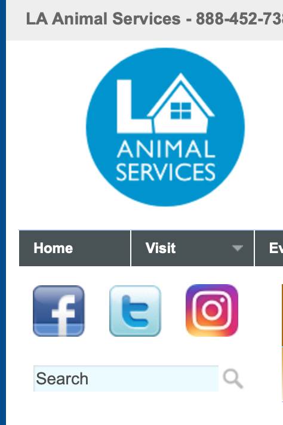

However, the site uses terms like "SMART", "Emergency Equine Response Team", and "Kuranda bed" in their drop down menus. While they do a sufficient job of explaining these terms on their respective pages, many users might be unsure what these acronyms and industry-specific terms mean. It would be more intuitive to use descriptive terms as headers that any user can understand and be able to navigate to the right page, and then explain the terms on those pages instead. (Severity Level: 1)

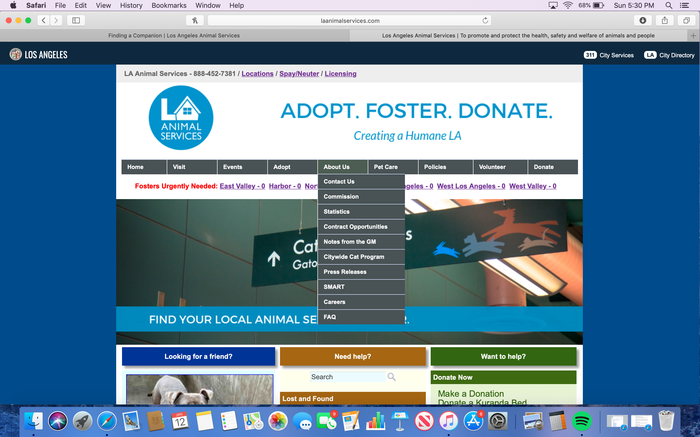

## 3. User control and freedom.

The link to the foster application takes the user to a PDF in which users cannot type into the form. There is not a specific "print" option and it does not contain instructions on how to submit the form. The user does not have the ability to use this page and is not provided with options. (Severity Level: 2)

[Foster application](http://www.laanimalservices.com/wp-content/uploads/2019/06/foster-application.pdf)

## 4. Consistency and standards.

On the calendar page, there are multiple calendars with different formats. There is a master Google calendar at the top of the page with all of the events displayed. Below are two grids: "Volunteer Orientations" and "Wildlife Workshops". These events are already included on the Google calendar, with all of the same information included, so it is unnecessary to have both and may lead to user confusion. (Severity Level: 2)

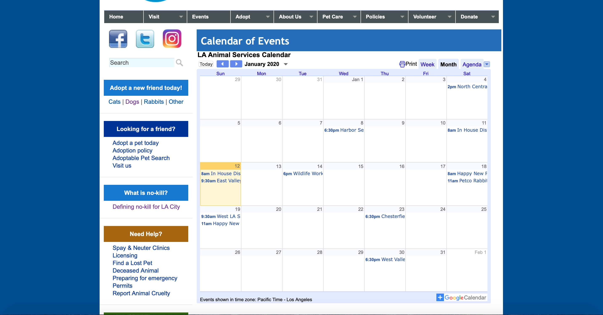

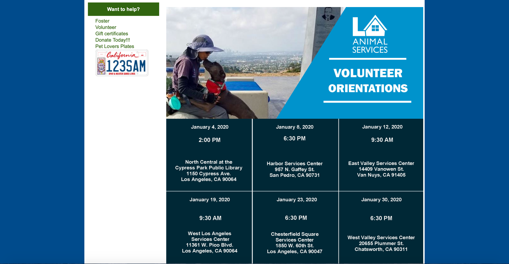

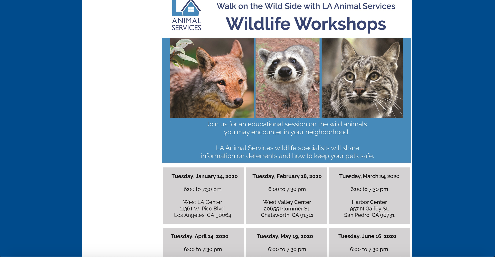

On every page there is the toolbar at the top, as well as a sidebar. Many of these links are redundant. For example, clicking the header "Adopt" on the top toolbar menu brings you to the same page as clicking "Adopt a pet today" under the "Looking for a friend" section on the side toolbar menu. (Severity Level: 2)

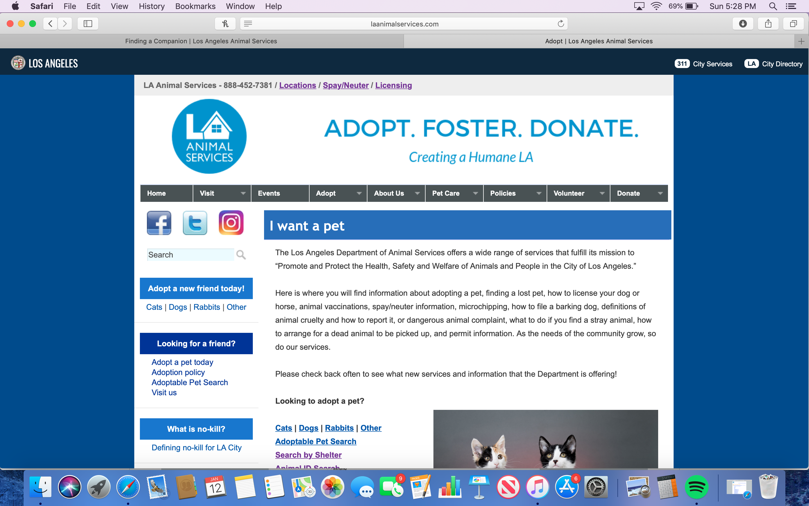

On the online volunteer form, some fields are denoted with a blue asterick for required field while others have the written out "answer required". (Severity Level: 1)

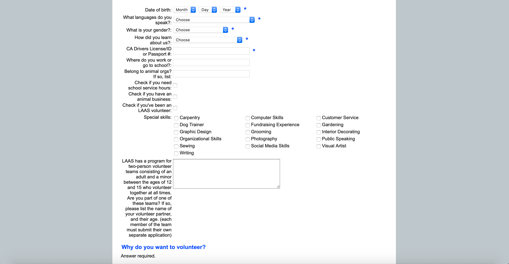

## 5. Error prevention.

The online volunteer form has many required fields. If a user does not complete the required fields, the page does not let them continue until they have fixed the errors. Once the errors are made, the website gives suggestions on how to fill them in correctly; for example, it explains how to format the zip code and email addresses. These suggestions are only made after the error is made. These suggestions should be present before the errors are made to help the user. (Severity Level: 1)

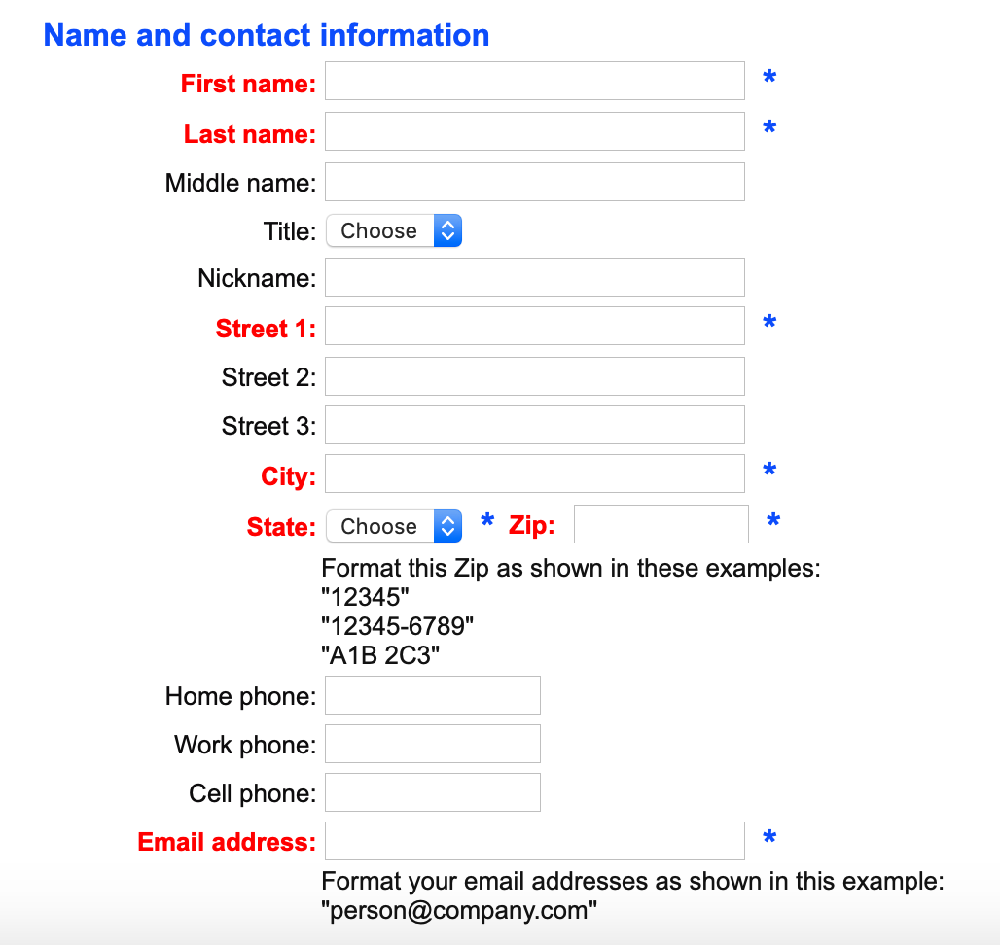

## 6. Recognition rather than recall.

If users have lost an animal, there is the option to search by animal ID. However, users may not recall their animal ID number which would prevent them from using this feature. The website then gives the option to view "Dogs/cats found by the public". This redirects the user to a page of over 50 animals to look through which minimal descriptions, many of which do not have a photo attached. There is another option to search for animals by shelter. However, lost animals may travel far distances and users still have to then sort through pages of animals. This system first expects users to recall a long code, which is not ideal, and if recall is not available, the other option is to do a lot of manual searching through different channels. This process should be streamlined by combining these search tactics into one process and by using recognition techniques. (Severity level: 3)

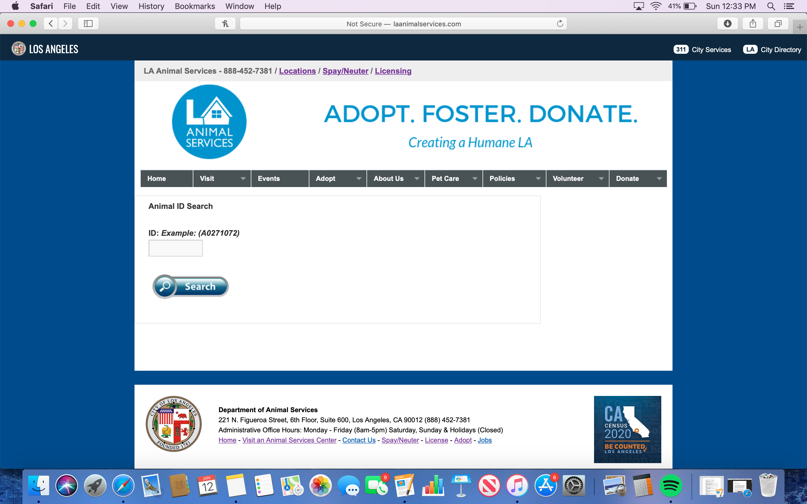

## 7. Flexibility and efficiency of use.

There appears to be little flexibility for efficiency in the LAAS website. As mentioned in point 4, there are multiple ways to navigate to the same pages. While this does provide "flexibility" it is not necessarily efficient. It becomes confusing for the user as they have multiple options and may get stuck in a loop trying to find a page. A user who frequents the site may figure out the best way to navigate the website; however it does not allow users to use advanced skills to increase efficiency. (Severity Level: 2)

Top toolbar

Side toolbar

## 8. Aesthetic and minimalist design.

The design of the LAAS website is overwhelming. There are multiple formats for pages. Some have a second toolbar at the top while others do not. (See screenshot of "Adopt" page vs "Volunteer" page.) There are too many options under the drop down menus, but they are not comprehensive. Due to the complicated design of the website, users could become confused and miss pages because it is not consistent. (Severity Level: 2)

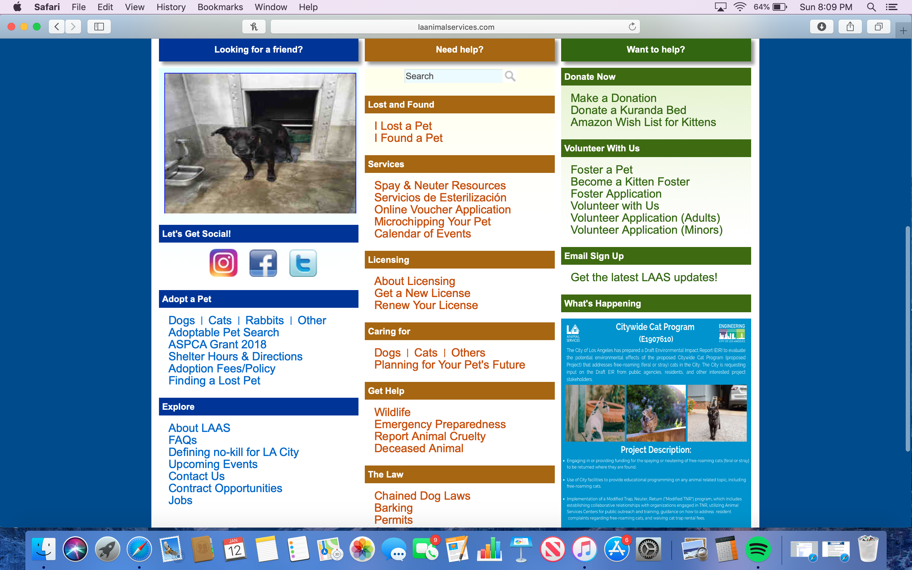

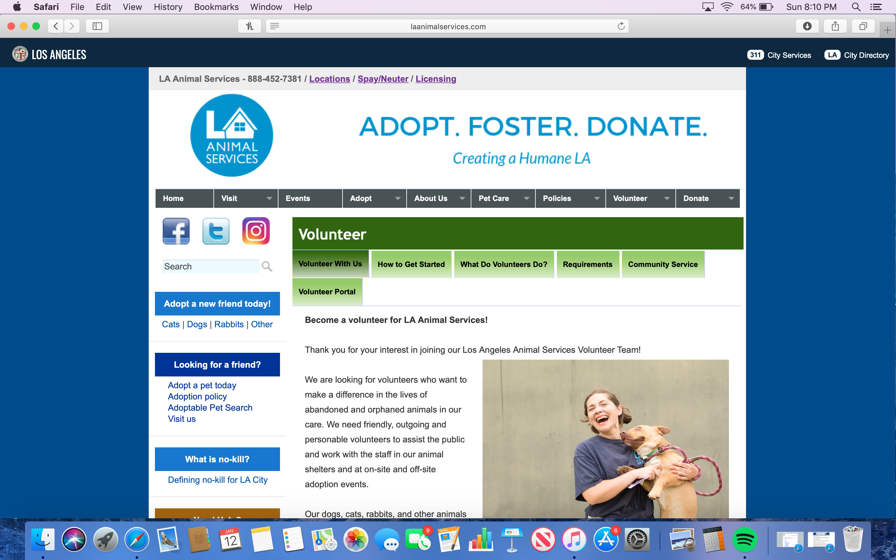

## 9. Help users recognize, diagnose, and recover from errors.

To test the animal search feature, I inputted a false animal ID. I was then given an error message stating: "Remember, the fewer things you search on, the more animals you will see. Use the 'No Preference' option for breed, gender, age, size and color to see the most animals." at the top of the page, as well as: "We are very sorry, but due to high usage we were unable to process your request. Please wait a few moments and try again." in the middle of the page. To the user it is unclear what caused the error and what can be done to fix it. (Severity Level: 2)

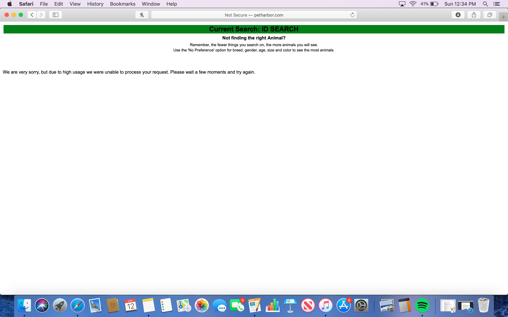

## 10. Help and documentation.

The search bar on the homepage is small in size, but centered and towards the top of the page. Once you navigate off the homepage the search bar is now on the sidebar, which is not too difficult to spot, but is not intuitive since it has moved locations. Additionally, searching for a simple key word like "adopt" generates results of blog posts instead of how to navigate the website to the adoption pages. The FAQs provide more relevant information to an "adopt" search; however they are located under the "About Us" menu on the top toolbar and not under the "Need Help" menu on the side toolbar. (Severity Level: 2)

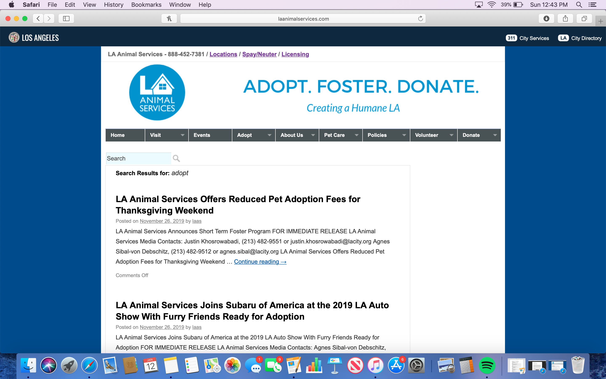

# Example 2: PETA

[PETA website](https://www.peta.org)

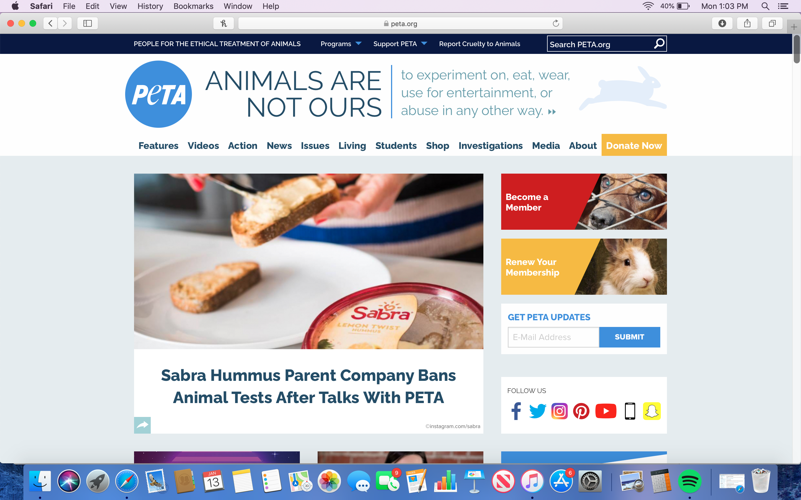

PETA, or People for the Ethical Treatment of Animals, is a nonprofit dedicated to animal rights. The website gives users options to educate themselves, donate, and support the cause. The PETA website is visually appealing and contains many images to accompany its pages. There are 12 menu options at the top of the page, which have a consistent design; when you click on them they have more options on the left side of the page. The website is full of articles, making it seem like a collection of blog posts; however, it also contains informational pages and ways to volunteer and donate. 

While the PETA website is organized, it still has an overwhelming amount of information in which the user could become lost. The website could benefit from providing a page of "quick" or "popular" links to bring users to the pages they are most likely to seek.  

# Heuristic Evaluation for PETA

## 1. Visibility of system status.

While it is helpful that the website offers a "back to top" button after certain sections, it would be beneficial for the user to know exactly where on the page they are to be able to make the decision to continue or not. This could be easily achieved by highlighting the section already present on the left toolbar. (Severity Level: 1)

## 2. Match between system and the real world.

It is clear from the PETA website that the organization encourages users to share their material on social media. However, some of the symbols they choose to use could be somewhat confusing to the user. For example, the arrow in the left corner appears to be welcoming users to launch the article; however, when the mouse is hovered over it, options to share to social media are revealed instead. (Severity Level: 1)

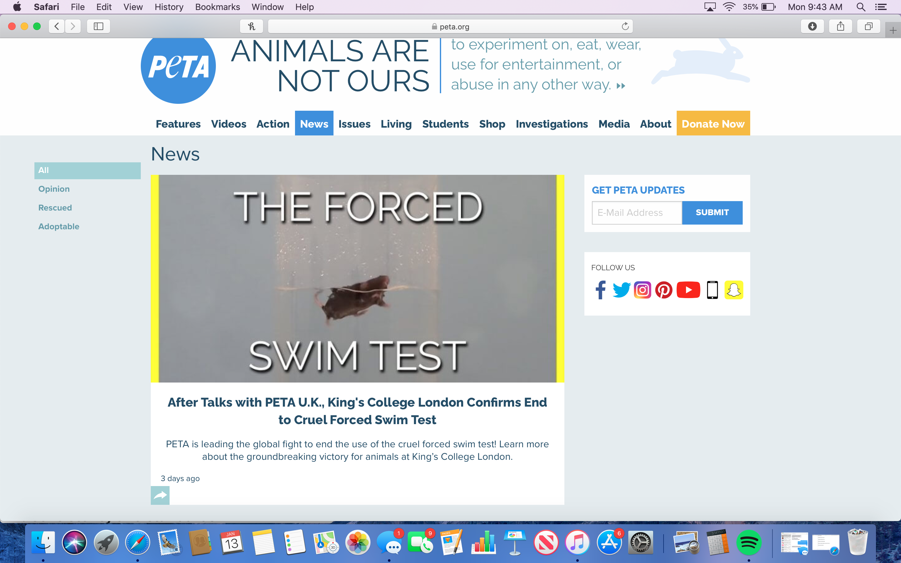

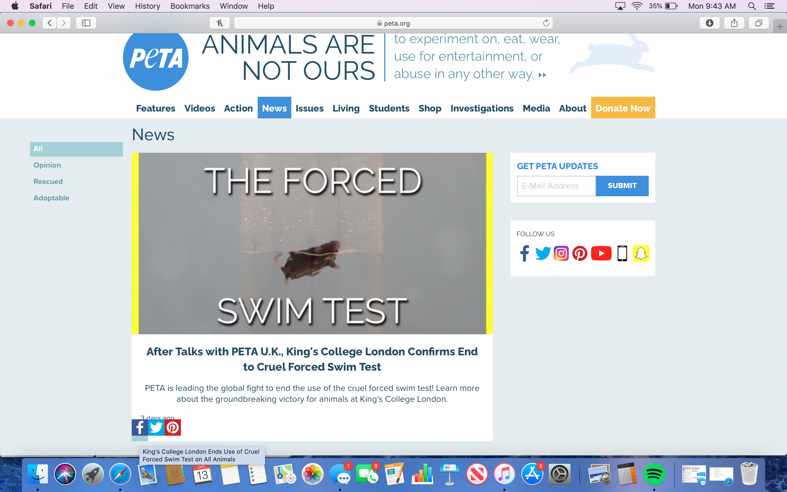

## 3. User control and freedom.

Every time the home page is loaded, the user recieves a pop-up ad. Sometimes the ad is layered with another message (see below) asking for the users permission to pester them with more automated pop-ups. This is both an annoyance to the user and limits their control as they have to spend time looking for the exit button to dismiss the ads. (Severity Level: 1)

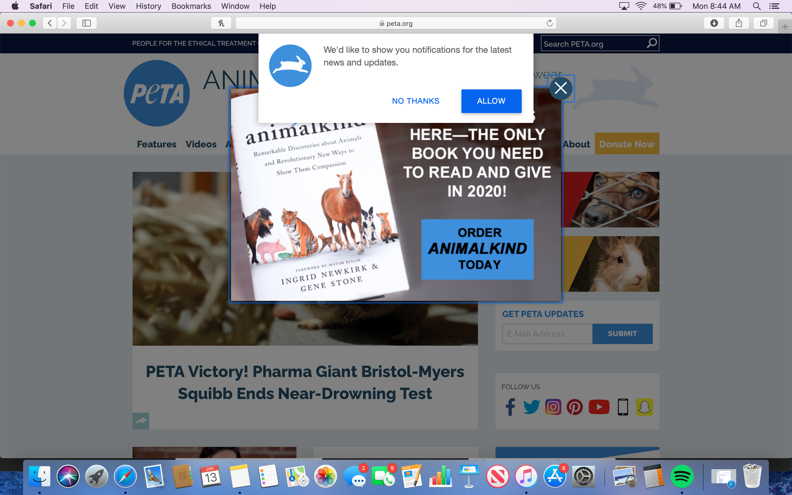

## 4. Consistency and standards.

As stated in point 2, PETA clearly wants to highlight their social media. However, they do not keep their symbols conisitent, even on the same page. While it is still clear what the symbols mean, they are not following a standard. (Severity Level: 1)

## 5. Error prevention.

When filling out any form on PETA's website, they separate their reqiured fields from non-required fields simply by bolding the required fields. However, this distinction is not obvious and does not follow standard practices. Using an asterick or coloring those fields in red would be more effective in preventing users from making this error. (Severity Level: 1)

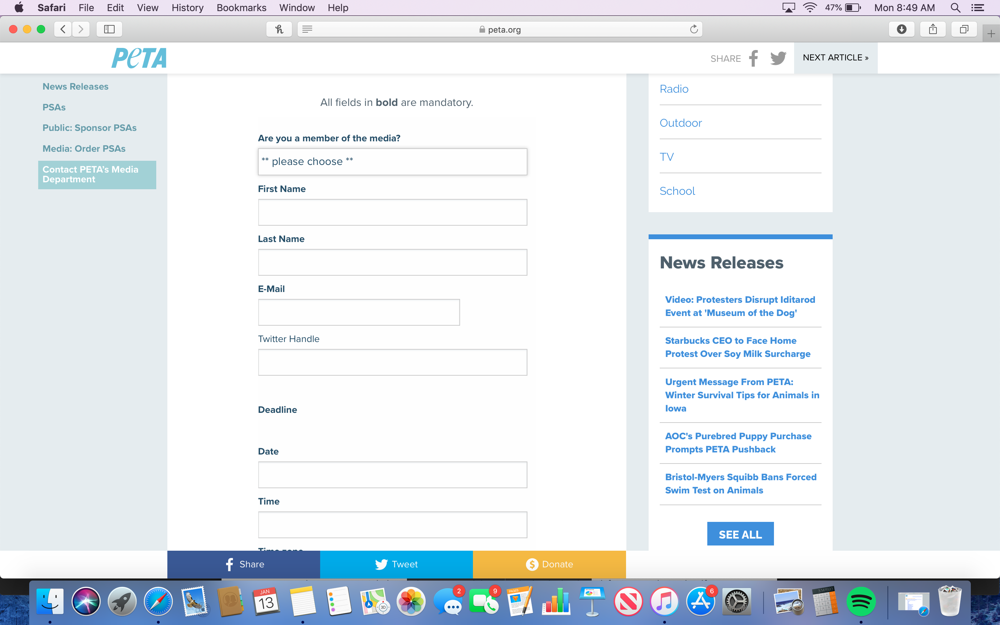

## 6. Recognition rather than recall.

The "Action" page simply has a search bar to "Search Action Alerts". The page provides examples of action alerts below the searchbar; however, unless a user has a specific cause in mind and knows which keywords to search for, searching a simple term like "dog" leads them to over 100 results to sort through manually. It would be more helpful to separate action alerts into categories and provide categories to search within, instead of just providing random examples. (Severity Level: 2)

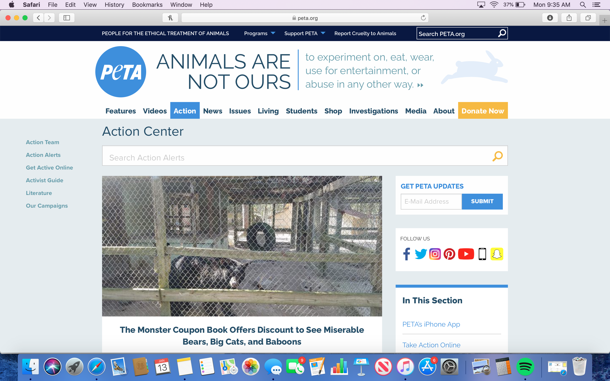

## 7. Flexibility and efficiency of use.

PETA has an accesibility page to allow disabled users to use their website efficiently. This is a great feature to allow users of all abilities as well as experience levels to navigate the website. Additionally, these features are clearly explained so that users can access them.

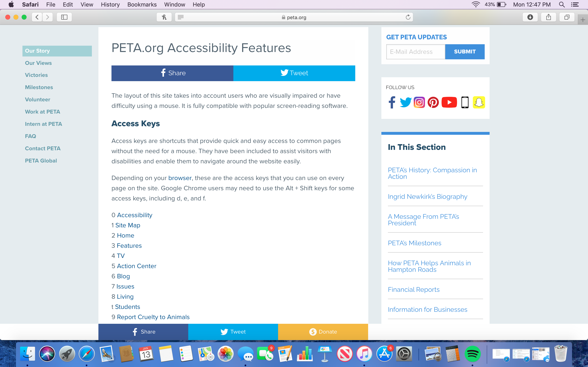

## 8. Aesthetic and minimalist design.

The design of the PETA website is consistent and minimalistic. They use language that users can understand and provide aesthetically pleasing, relevant photos that enhance the design of the website. 

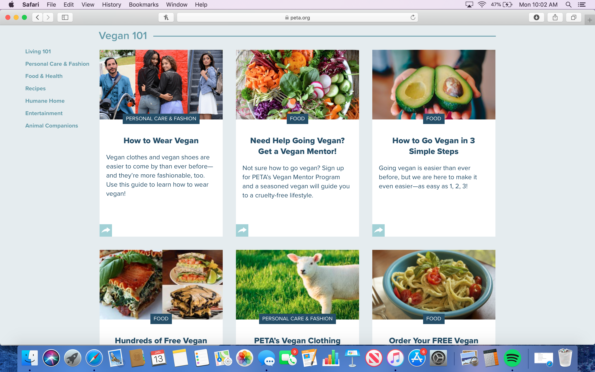

## 9. Help users recognize, diagnose, and recover from errors.

When trying to submit a volunteer form without any information, the website generates an error message stating an invalid email address. Then when a valid email address in inputted (but still nothing else) another error message appears that says first name is missing. It would be much more efficient for all of the missing field errors to be diagnosed at once instead of one by one. As stated in point 5, it is already unclear which fields are required so it would not be surprising for users to encounter this error. (Severity Level: 3)

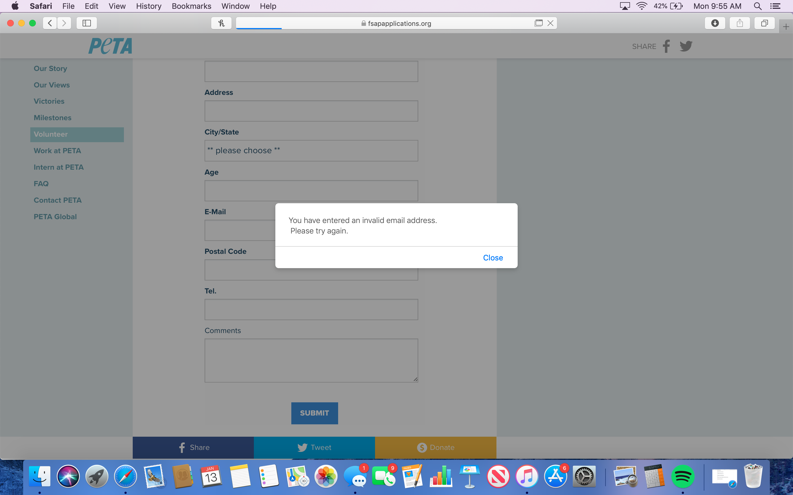

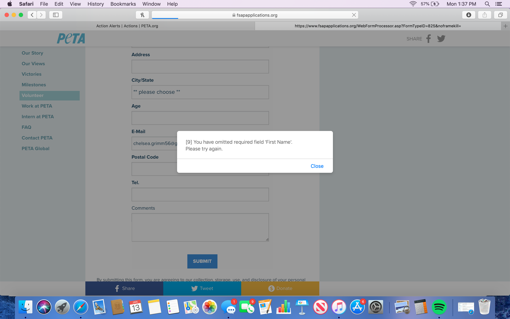

## 10. Help and documentation.

The PETA website has a good example of a help page. They have a full "Site Map" page to help users navigate their website. The search bar stays in a consistent location and generates helpful results, often referring users to the FAQ page.

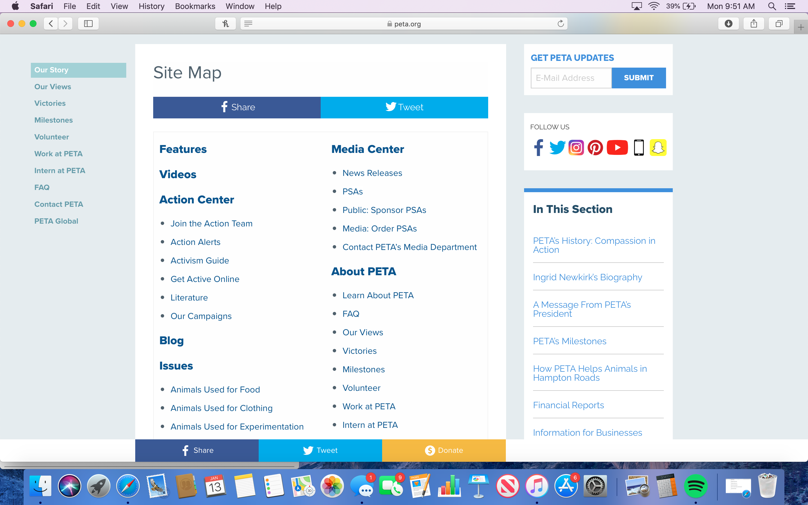
