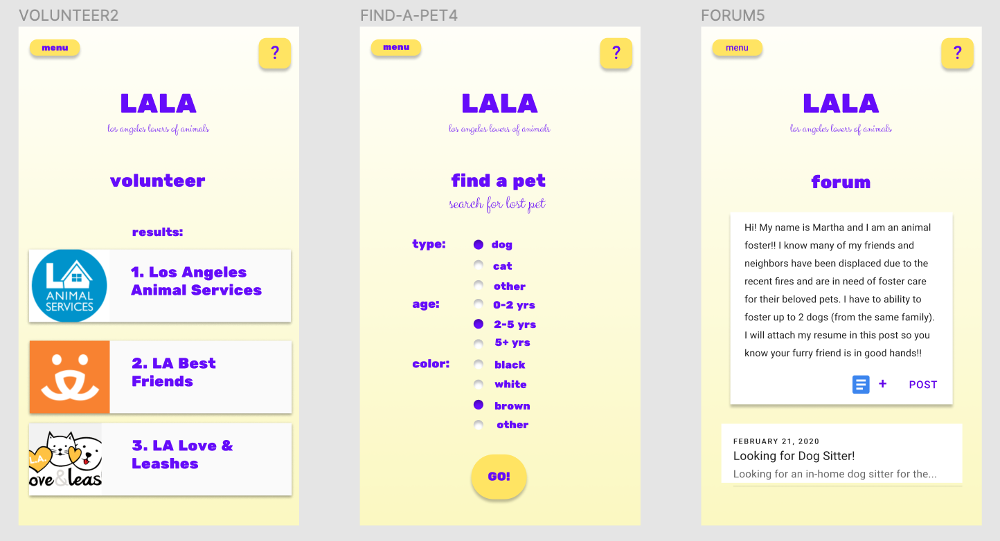
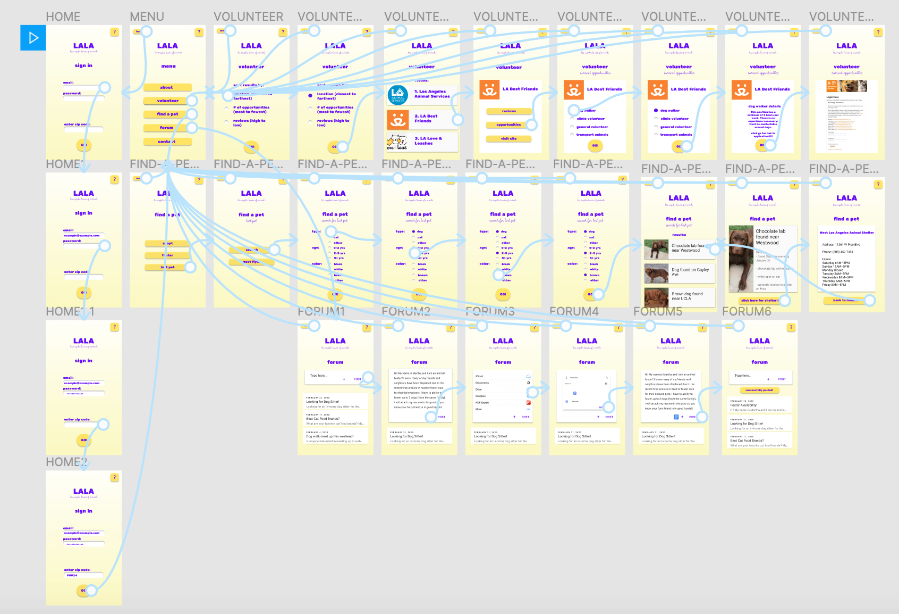

# High Fidelity Prototype

## Description (A brief description of your project, the purpose and process of this prototyping phase (3-5 sentences))

## List of tasks (A list of tasks that the interactive prototype of your system supported.)

## Example of screen designs (One image with the representative examples of screen designs (3-5 screens))

## Decision making (Description of your decision making of the graphical interface design, including the choice of the color scheme and note if you considered/checked accessibility color contrast.)

## Wireflow (One image with the wireflow with graphic design)

## Link to interactive prototype

[Protoype](https://www.figma.com/proto/yrt0fLRb55mjJpQWfaZFiy/HighFidelityPrototype?node-id=7%3A1&scaling=scale-down)
